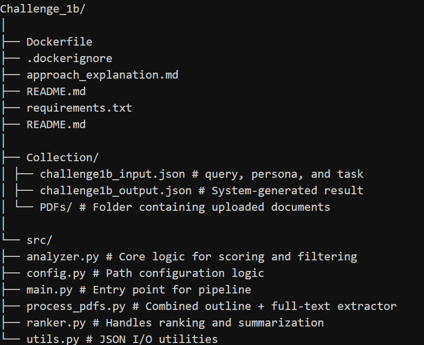

# Semantic PDF Analysis Engine

## Overview

This project is an advanced pipeline designed to perform semantic analysis on a collection of PDF documents. Instead of relying on simple keyword matching, it understands the user's intent—defined by a "persona" and a "job to be done"—to find, rank, and summarize the most relevant sections from the documents.

The engine is particularly powerful for complex queries and can handle specific constraints, such as dietary restrictions (e.g., finding vegetarian or gluten-free recipes), making it a sophisticated tool for contextual information retrieval.

---

## Key Features

- **Semantic Search:** Uses state-of-the-art `sentence-transformers` to understand the meaning behind a query, not just the words themselves.
- **Dual Keyword Strategy:** Uses both KeyBERT for contextual phrases and spaCy for important single-word constraints.
- **Constraint Filtering:** Intelligently filters out irrelevant content, e.g., excludes sections with meat if the query is vegetarian.
- **One-Pass Processing:** Extracts titles, outlines, and full-text from PDFs in a single pass to reduce overhead.
- **Batch Embedding:** Encodes all sections at once to avoid performance bottlenecks.
- **Section Reconstruction:** Combines headings and page numbers to accurately extract multi-page sections.
- **Batch Summarization:** Uses `distilbart-cnn-6-6` model to refine long content, while skipping summarization for short sections.
- **Dockerized:** Fully containerized for reproducibility and isolation.

---

## How It Works: The Technical Approach

The project operates as a four-stage pipeline, orchestrated by `main.py`.

### Stage 1: PDF Outline + Full Text Extraction

- **Module:** `process_pdfs.py`
- **Goal:** Extract each PDF’s title, heading structure, and full page-wise text in one pass.
- **How:**
  - Uses `pdfplumber` and `PyMuPDF (fitz)` together.
  - Heuristics and NLP logic filter out tables/forms and extract proper headings.
  - Headings are assigned levels (H1/H2/H3) based on numbering and formatting.
  - Titles are extracted from the top of the first page.

### Stage 2: Preparation for Analysis

- **Module:** `main.py`
- **Goal:** Feed structured data to the analyzer.
  - `process_pdfs.py` now returns both outline and full text.
  - Automatically switches between Docker and local paths using `config.py`.

### Stage 3: Core Semantic Analysis

- **Module:** `analyzer.py`
- **Goal:** Score and filter relevant sections from the PDF content.
- **Logic:**
  - **Query Embedding:** Encodes the persona + job into a sentence vector.
  - **Tiered Keywords:**
    - KeyBERT generates contextual multi-word phrases.
    - spaCy identifies critical single words (noun, verb, adj, propn).

  - **Multi-Factor Scoring:**
    - Base semantic similarity
    - Bonuses for phrase and word hits
    - Boost if keywords are in title or filename
  - **Batch Embedding:** All section embeddings are calculated together.

### Stage 4: Ranking and Summarization

- **Module:** `ranker.py`
- **Goal:** Rank sections and return summaries.
- **Process:**
  - Highest scored sections per document are selected (max 2-3 per PDF).
  - Short sections are returned directly.
  - Long sections are cleaned and summarized using Hugging Face summarizer.

---

## Output

The final result is a `challenge1b_output.json` containing:
- `metadata`: persona, job, list of input PDFs, timestamp
- `extracted_sections`: top-ranked sections
- `subsection_analysis`: refined summaries

---

## Directory Structure

---

## ✅ Constraints:

• Must run on CPU only  
• Model size ≤ 1GB  
• Processing time ≤ 60 seconds for document collection (3-5 documents)  
• No internet access allowed during execution  

📦 Models Used:
• sentence-transformers/all-MiniLM-L6-v2 → ~91 MB  
• sshleifer/distilbart-cnn-6-6           → ~438 MB  

📊 Total Model Size: **529 MB**
